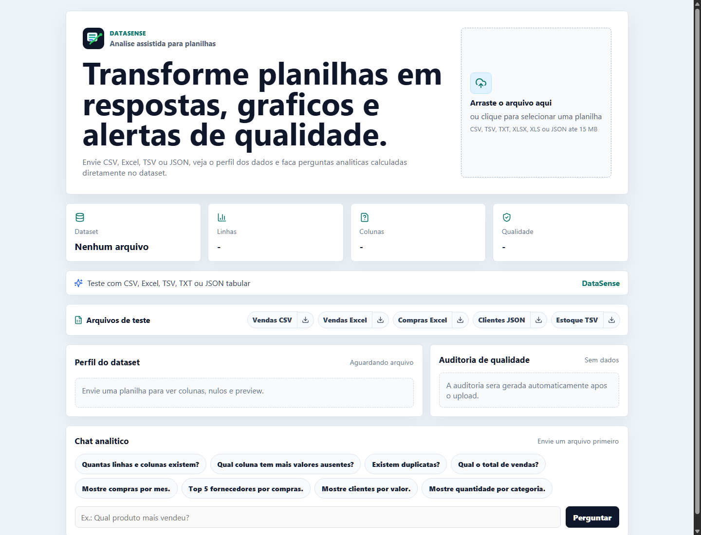
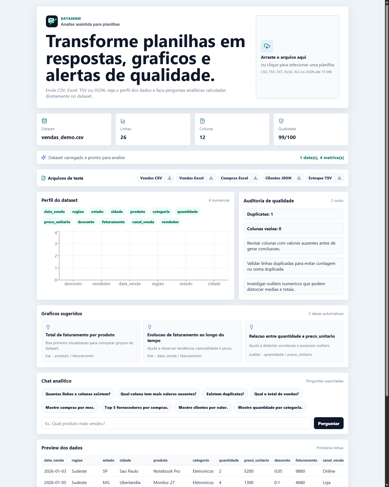

# DataSense

Projeto de portfolio em Data Science e Gestao da Informacao.

O DataSense e uma aplicacao onde o usuario faz upload de uma planilha ou arquivo tabular e conversa com os dados em linguagem natural. A ferramenta gera respostas analiticas, graficos, insights, auditoria de qualidade dos dados e recomendacoes praticas.

## Links

- Site publicado: `https://data-sense-three.vercel.app/`
- API publicada: `https://data-sense-api.onrender.com`
- Documentacao da API: `https://data-sense-api.onrender.com/docs`

## Preview





## Objetivo

Criar um produto demonstravel para entrevistas e processos seletivos, mostrando habilidades em:

- Python para tratamento e analise de dados.
- SQL para consultas estruturadas.
- Visualizacao de dados.
- Inteligencia artificial aplicada a analise exploratoria.
- Auditoria e qualidade de dados.
- UX voltada para usuarios de negocio.
- Documentacao tecnica e de produto.

## Problema

Muitas pessoas e empresas possuem dados em planilhas, mas nao sabem transformar esses dados rapidamente em perguntas respondidas, graficos, diagnosticos e decisoes. O projeto resolve esse problema oferecendo uma experiencia simples: enviar CSV, Excel, TSV, TXT ou JSON tabular, perguntar em linguagem natural e receber uma analise confiavel.

## Solucao

O sistema atuara como um assistente para analise de dados:

- Le CSV, TSV, TXT delimitado, Excel e JSON tabular enviados pelo usuario.
- Detecta melhor o cabecalho real em planilhas Excel que possuem linha de titulo antes da tabela.
- Identifica colunas, tipos de dados, valores ausentes e possiveis problemas.
- Sugere conversao para colunas de periodo, como mes e trimestre, quando elas aparecem como texto.
- Permite perguntas em linguagem natural sobre os dados.
- Gera consultas, tabelas resumidas, graficos e explicacoes para dados de vendas, compras, clientes, fornecedores, categorias e regioes.
- Prioriza metricas de negocio, como receita/faturamento/valor total, evitando somar NF, prazo, avaliacao ou desconto por engano.
- Monta um dashboard automatico apos o upload com KPIs, evolucao mensal, rankings, nulos e score de qualidade.
- Permite personalizar o dashboard com titulo, tema, logo, tipo de grafico, ordem dos graficos e graficos ocultos.
- Recalcula o dashboard com filtros de periodo e categorias, como produto, fornecedor, cliente, categoria, regiao ou canal.
- Detecta anomalias e problemas de qualidade.
- Gera uma auditoria inteligente da confiabilidade da analise, apontando cabecalho suspeito, datas como texto, metricas inadequadas, totais negativos, nulos, duplicatas e outliers.
- Pode usar IA para revisar a auditoria quando `OPENAI_API_KEY` estiver configurada; sem chave, usa regras locais.
- Sugere proximas analises e recomendacoes de negocio.
- Exporta relatorio em PDF ou PNG com resumo, qualidade, insights, graficos e recomendacoes.
- Renderiza graficos reais no relatorio, com mensagem clara quando nao ha dados suficientes para desenhar uma visualizacao.
- Exporta o dashboard personalizado em PDF via impressao e PNG gerado no navegador.
- Exporta pacote Power BI com dados tratados, comparativo mensal, insights gerenciais, graficos sugeridos e metadados.
- Mantem historico local das ultimas analises carregadas.

## Documentacao

- [Definicao do projeto](docs/01-definicao-do-projeto.md)
- [Roadmap](docs/02-roadmap.md)
- [Registro de decisoes](docs/03-registro-de-decisoes.md)
- [Definicao tecnica do MVP](docs/04-definicao-tecnica-mvp.md)
- [Pacote Power BI](docs/05-pacote-power-bi.md)

## Estrutura inicial

```text
backend/
  app/
    main.py
    services/
frontend/
  src/
data/
  sample/
    clientes_demo.json
    compras_demo.csv
    compras_demo.xlsx
    estoque_financeiro_demo.tsv
    vendas_demo.csv
    vendas_demo.xlsx
docs/
```

## Como executar localmente

### Backend

```bash
cd backend
python -m venv .venv
.venv\Scripts\activate
pip install -r requirements.txt
uvicorn app.main:app --reload
```

A API ficara disponivel em:

- `http://127.0.0.1:8000/health`
- `http://127.0.0.1:8000/docs`

Para ativar a revisao de qualidade com IA no backend, configure:

```bash
OPENAI_API_KEY=sua_chave_openai
OPENAI_MODEL=gpt-5.4-mini
```

Se `OPENAI_API_KEY` nao existir, a rota de auditoria usa somente regras locais e segue funcionando normalmente.

### Frontend

```bash
cd frontend
npm install
npm run dev
```

Se preferir usar pnpm:

```bash
cd frontend
pnpm install
pnpm run dev
```

O frontend ficara disponivel em:

- `http://localhost:5173`

Para apontar o frontend para uma API publicada, crie `frontend/.env` com:

```bash
VITE_API_BASE_URL=https://sua-api.onrender.com
```

### Identidade visual

O projeto usa o nome DataSense e possui logo em SVG nos arquivos:

- `frontend/public/brand-mark.svg`
- `frontend/public/logo-datasense.svg`

## Deploy

### Backend no Render

O arquivo `render.yaml` define a API como um Web Service Python:

- Build: `pip install -r requirements.txt`
- Start: `uvicorn app.main:app --host 0.0.0.0 --port $PORT`
- Health check: `/health`

### Frontend na Vercel

Configure a Vercel com root directory `frontend` e defina a variavel:

- `VITE_API_BASE_URL`: URL publica da API no Render

Deploy atual:

- `https://data-sense-three.vercel.app/`

### Formatos aceitos

- CSV (`.csv`)
- TSV (`.tsv`)
- TXT delimitado (`.txt`)
- Excel (`.xlsx` e `.xls`)
- JSON tabular (`.json`)

O limite inicial de upload e de 15 MB.

### Dataset demonstrativo

Use os arquivos:

- `data/sample/vendas_demo.csv`
- `data/sample/vendas_demo.xlsx`
- `data/sample/compras_demo.csv`
- `data/sample/compras_demo.xlsx`
- `data/sample/clientes_demo.json`
- `data/sample/estoque_financeiro_demo.tsv`

Eles possuem dados ficticios de vendas, compras, clientes e estoque/financeiro. O frontend tambem publica esses arquivos em `frontend/public/samples`, permitindo carregar exemplos diretamente pela interface.

Perguntas uteis para teste:

- `Mostre vendas por mes.`
- `Top 5 produtos por faturamento.`
- `Top 5 fornecedores por compras.`
- `Mostre compras por mes.`
- `Mostre clientes por receita.`
- `Mostre valor_total por produto.`

## Status

Fase atual: MVP funcional em desenvolvimento, com upload por clique ou arrastar/soltar, leitura de CSV/Excel/TSV/TXT/JSON, perfil automatico, dashboard automatico personalizavel, filtros globais, historico local, auditoria de qualidade, chat analitico e sugestoes de graficos.

Tambem ja possui exportacao de relatorio em PDF/PNG apos o carregamento do dataset.
