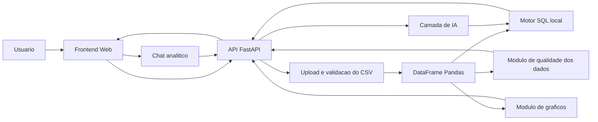

# Definicao do Projeto: DataSense Copilot

## 1. Visao geral

O DataSense Copilot sera uma aplicacao web de analise automatizada de dados. O usuario envia um arquivo CSV e interage com os dados por meio de perguntas em linguagem natural, como:

- Qual produto mais vendeu?
- Quais meses tiveram maior faturamento?
- Existe alguma anomalia nos dados?
- Crie um grafico de vendas por regiao.
- Quais campos possuem mais problemas de preenchimento?

O produto combina analise exploratoria, consultas estruturadas, visualizacao, auditoria de qualidade e geracao de insights.

## 2. Proposta de valor

Transformar uma planilha bruta em respostas, graficos e recomendacoes de forma rapida, clara e interativa.

Para recrutadores, o projeto demonstra capacidade de criar uma solucao completa, com aplicacao pratica em ambientes de negocio, usando competencias importantes para Data Analyst, BI Analyst, Data Scientist Junior e profissionais de Gestao da Informacao.

## 3. Publico-alvo

- Analistas de dados iniciantes.
- Profissionais de negocio que usam planilhas.
- Pequenas empresas que precisam explorar dados sem montar um BI completo.
- Recrutadores avaliando portfolio de Data Science e Gestao da Informacao.

## 4. Escopo principal

O projeto principal sera o DataSense Copilot.

O Auditor de Qualidade de Dados entrara como modulo interno do produto, porque aumenta o valor do projeto sem desviar da ideia central.

### Dentro do escopo

- Upload de arquivos CSV.
- Leitura e validacao inicial dos dados.
- Resumo automatico do dataset.
- Conversa com os dados em linguagem natural.
- Respostas com tabelas, metricas e explicacoes.
- Geracao de graficos.
- Auditoria de qualidade dos dados.
- Deteccao simples de anomalias.
- Recomendacoes de proximas analises.
- Interface web demonstravel.
- Documentacao tecnica e de produto.

### Fora do escopo inicial

- Login de usuarios.
- Banco de dados multiusuario em producao.
- Upload de arquivos muito grandes.
- Suporte completo a Excel, PDF ou bancos externos.
- Treinamento de modelo proprio de IA.
- Automacoes corporativas avancadas.
- Deploy empresarial com controle de acesso.

Esses itens podem virar evolucoes futuras depois do MVP.

## 5. MVP

O MVP deve provar a experiencia central: enviar um CSV, entender o dataset e fazer perguntas sobre ele.

Funcionalidades do MVP:

1. Upload de CSV.
2. Pre-visualizacao dos dados.
3. Perfil automatico do dataset:
   - numero de linhas;
   - numero de colunas;
   - tipos de dados;
   - valores nulos;
   - colunas numericas, categoricas e datas.
4. Chat analitico com perguntas em linguagem natural.
5. Execucao de analises seguras usando Python e/ou SQL local.
6. Respostas em texto com metricas e tabelas.
7. Geracao de pelo menos tres tipos de grafico:
   - barras;
   - linha;
   - pizza ou rosca;
   - dispersao, se fizer sentido para o dataset.
8. Auditoria basica de qualidade:
   - valores ausentes;
   - duplicatas;
   - possiveis outliers;
   - colunas com tipos inconsistentes;
   - score de qualidade dos dados.
9. Exportacao ou captura visual dos insights principais.

## 6. Funcionalidades futuras

- Suporte a arquivos Excel.
- Historico de conversas por dataset.
- Exportacao de relatorio em PDF.
- Modo Data Storytelling Automatico.
- Dashboard automatico gerado a partir do CSV.
- Comparacao entre datasets.
- Recomendacoes de limpeza de dados com aplicacao assistida.
- Conexao com banco PostgreSQL.
- Deploy publico para portfolio.

## 7. Experiencia do usuario

Fluxo principal:

1. Usuario acessa a aplicacao.
2. Faz upload de um CSV.
3. O sistema mostra uma visao geral do dataset.
4. O usuario faz perguntas no chat.
5. O sistema responde com analises, graficos e insights.
6. O sistema sugere perguntas relevantes.
7. O usuario pode consultar a aba de qualidade dos dados.

Telas previstas:

- Tela de upload.
- Visao geral do dataset.
- Chat analitico.
- Area de graficos e resultados.
- Auditoria de qualidade dos dados.
- Historico ou painel de insights da sessao.

## 8. Stack tecnica sugerida

### Backend

- Python.
- FastAPI para API.
- Pandas para manipulacao de dados.
- DuckDB ou SQLite para consultas SQL sobre o CSV.
- NumPy e SciPy para calculos auxiliares.
- Scikit-learn para deteccao simples de anomalias, se necessario.

### IA

- API de modelo de linguagem para interpretar perguntas e gerar explicacoes.
- Camada de seguranca para limitar a IA a operacoes analiticas permitidas.
- Prompts documentados e versionados.

### Frontend

- React com TypeScript.
- Componentes de UI reutilizaveis.
- Recharts, Plotly ou ECharts para visualizacao.

### Qualidade e documentacao

- Testes unitarios para funcoes de analise.
- Documentacao em Markdown.
- Dados de exemplo versionados.
- README com instrucoes de execucao.

## 9. Arquitetura inicial

## 10. Riscos e cuidados

- Evitar que a IA invente respostas que nao existem nos dados.
- Mostrar quando uma resposta foi calculada diretamente no dataset.
- Tratar arquivos CSV com separadores, encoding e formatos diferentes.
- Limitar tamanho de arquivo no MVP.
- Criar mensagens claras quando o dataset nao possui colunas necessarias para uma pergunta.
- Evitar execucao livre de codigo gerado por IA.

## 11. Criterios de sucesso

O projeto sera considerado bem-sucedido quando:

- Um recrutador conseguir testar a aplicacao com um CSV de exemplo.
- O sistema responder perguntas simples e intermediarias sobre os dados.
- O sistema gerar graficos uteis.
- O sistema identificar problemas de qualidade no dataset.
- O README explicar claramente o problema, a solucao, a stack e como executar.
- O portfolio mostrar screenshots, arquitetura, decisoes e aprendizados.

## 12. Nome do projeto

Nome principal: DataSense Copilot.

Possiveis nomes alternativos para branding:

- Insight Copilot.
- CSV Copilot.
- Data Analyst Copilot.
- AnalystAI.

Decisao atual: adotar DataSense Copilot por soar mais memoravel como produto, mantendo clareza para entrevistas e portfolio.
