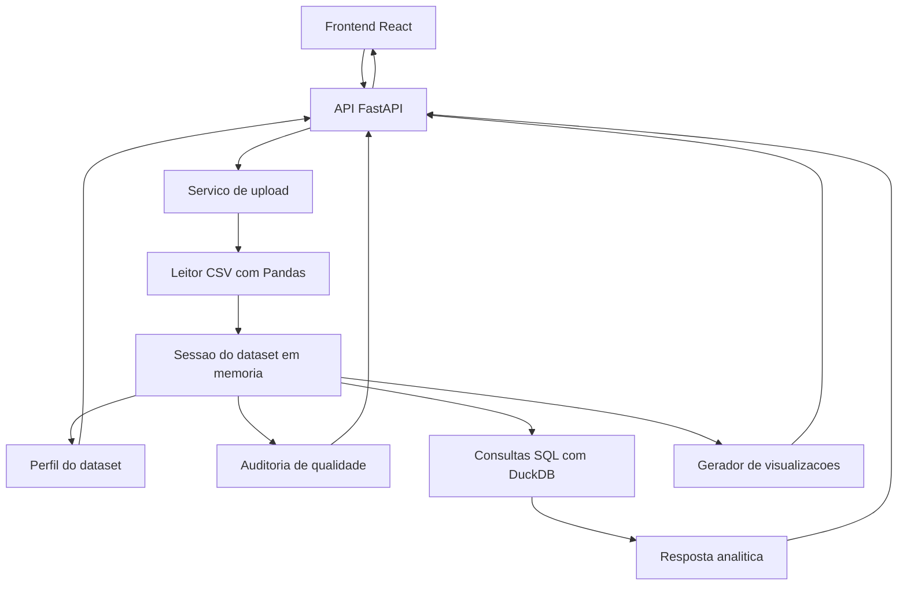

# Definicao Tecnica do MVP

## 1. Objetivo tecnico

Construir a primeira versao funcional do DataSense com foco em uma experiencia demonstravel:

1. Usuario envia um arquivo CSV.
2. Sistema valida e interpreta o dataset.
3. Sistema apresenta resumo, qualidade dos dados e pre-visualizacao.
4. Usuario faz perguntas analiticas.
5. Sistema responde com metricas, tabelas, graficos e explicacoes.

O MVP deve ser simples o bastante para ser construido em etapas, mas robusto o bastante para impressionar em portfolio.

## 2. Stack escolhida

### Backend

- Python.
- FastAPI para criacao da API.
- Pandas para leitura, limpeza e analise dos dados.
- DuckDB para executar SQL sobre DataFrames e arquivos CSV.
- Pydantic para validacao e padronizacao dos contratos de resposta.
- Pytest para testes unitarios.

### Frontend

- React.
- TypeScript.
- Vite.
- Recharts para visualizacoes.
- CSS organizado por componentes.

### Dados

- CSV como formato principal no MVP.
- Dataset demonstrativo versionado no repositorio.
- Processamento local em memoria na primeira versao.

### IA

- No MVP inicial, o chat tera um conjunto de perguntas e operacoes suportadas por regras.
- Em etapa posterior, a IA podera interpretar perguntas abertas e escolher a operacao analitica adequada.
- A IA nao devera executar codigo livre.
- Toda resposta analitica precisa ser baseada nos dados carregados.

## 3. Arquitetura tecnica do MVP



## 4. Modulos do backend

### API

Responsavel por expor endpoints HTTP para o frontend.

Endpoints previstos:

- `GET /health`: verificar se a API esta ativa.
- `POST /datasets/upload`: receber CSV e criar uma sessao de analise.
- `GET /datasets/{dataset_id}/profile`: retornar perfil automatico do dataset.
- `GET /datasets/{dataset_id}/preview`: retornar amostra tabular dos dados.
- `GET /datasets/{dataset_id}/quality`: retornar auditoria de qualidade.
- `POST /datasets/{dataset_id}/ask`: responder pergunta analitica.
- `POST /datasets/{dataset_id}/charts/suggest`: sugerir graficos possiveis.

### Servico de datasets

Responsavel por:

- Ler CSV.
- Detectar separador quando possivel.
- Tratar encoding comum.
- Guardar dataset em memoria durante a sessao.
- Gerar identificador unico do dataset.

### Servico de perfil

Responsavel por gerar:

- Quantidade de linhas.
- Quantidade de colunas.
- Nome das colunas.
- Tipos inferidos.
- Colunas numericas.
- Colunas categoricas.
- Colunas de data.
- Percentual de nulos por coluna.
- Estatisticas basicas para colunas numericas.

### Servico de qualidade

Responsavel por detectar:

- Valores ausentes.
- Linhas duplicadas.
- Colunas com cardinalidade muito alta.
- Possiveis outliers numericos.
- Colunas aparentemente vazias.
- Inconsistencia simples de tipos.
- Score geral de qualidade dos dados.

### Servico analitico

Responsavel por responder perguntas suportadas, como:

- Maior valor por categoria.
- Soma por categoria.
- Media por categoria.
- Evolucao temporal.
- Ranking top N.
- Deteccao simples de anomalias.
- Resumo geral do dataset.

### Servico de graficos

Responsavel por gerar especificacoes de graficos para o frontend renderizar.

Tipos iniciais:

- Barras.
- Linha.
- Pizza ou rosca.
- Dispersao.

## 5. Modulos do frontend

### Tela de upload

Permite selecionar um CSV e enviar para a API.

Estados previstos:

- Nenhum arquivo selecionado.
- Arquivo selecionado.
- Upload em andamento.
- Upload concluido.
- Erro de upload.

### Visao geral do dataset

Mostra:

- Nome do arquivo.
- Quantidade de linhas.
- Quantidade de colunas.
- Colunas principais.
- Tipos de dados.
- Preview das primeiras linhas.

### Auditoria de qualidade

Mostra:

- Score geral.
- Problemas encontrados.
- Colunas com mais valores ausentes.
- Duplicatas.
- Possiveis outliers.
- Sugestoes de correcao.

### Chat analitico

Permite:

- Fazer perguntas sobre o dataset.
- Ver resposta textual.
- Ver tabelas de resultado.
- Ver graficos quando aplicavel.
- Usar perguntas sugeridas.

### Area de visualizacoes

Mostra graficos gerados pelo sistema ou solicitados pelo usuario.

## 6. Requisitos funcionais

### RF01: Upload de CSV

O usuario deve conseguir enviar um arquivo CSV valido pela interface.

### RF02: Validacao do CSV

O sistema deve rejeitar arquivos vazios, arquivos sem colunas ou arquivos que nao possam ser lidos como tabela.

### RF03: Perfil automatico

O sistema deve gerar um resumo automatico do dataset apos o upload.

### RF04: Preview dos dados

O sistema deve exibir uma amostra das primeiras linhas do dataset.

### RF05: Auditoria de qualidade

O sistema deve gerar diagnostico de qualidade dos dados com score e problemas encontrados.

### RF06: Perguntas analiticas

O usuario deve conseguir fazer perguntas suportadas sobre os dados.

### RF07: Visualizacoes

O sistema deve gerar graficos a partir de agregacoes simples.

### RF08: Sugestoes de perguntas

O sistema deve sugerir perguntas relevantes com base nas colunas encontradas.

## 7. Requisitos nao funcionais

### RNF01: Clareza

As respostas devem explicar o resultado de forma compreensivel para usuarios de negocio.

### RNF02: Confiabilidade

As respostas devem ser calculadas diretamente a partir do dataset carregado.

### RNF03: Seguranca

O sistema nao deve executar codigo livre enviado pelo usuario ou gerado por IA.

### RNF04: Performance

O MVP deve funcionar bem com arquivos pequenos e medios, com limite inicial sugerido de ate 10 MB.

### RNF05: Manutenibilidade

As regras de analise, qualidade e visualizacao devem ficar separadas em modulos.

### RNF06: Portabilidade

O projeto deve rodar localmente com instrucoes claras no README.

## 8. Contrato inicial de respostas

As respostas da API devem seguir formatos previsiveis.

### Resposta de perfil

```json
{
  "dataset_id": "string",
  "file_name": "vendas.csv",
  "rows": 1000,
  "columns": 8,
  "column_types": {
    "produto": "categorical",
    "faturamento": "numeric",
    "data_venda": "datetime"
  },
  "missing_values": {
    "produto": 0,
    "faturamento": 3
  }
}
```

### Resposta analitica

```json
{
  "answer": "O produto com maior faturamento foi Notebook Pro.",
  "calculation": "sum(faturamento) grouped by produto",
  "table": [
    {
      "produto": "Notebook Pro",
      "faturamento": 125000
    }
  ],
  "chart": {
    "type": "bar",
    "x": "produto",
    "y": "faturamento",
    "data": []
  }
}
```

## 9. Perguntas suportadas no primeiro ciclo

O primeiro ciclo do chat analitico deve suportar perguntas como:

- Qual coluna tem mais valores ausentes?
- Quantas linhas e colunas existem?
- Qual produto mais vendeu?
- Qual categoria teve maior faturamento?
- Mostre vendas por mes.
- Mostre vendas por regiao.
- Quais sao os top 5 produtos por faturamento?
- Existem duplicatas?
- Existem possiveis outliers?

O sistema podera responder que uma pergunta nao e suportada quando nao houver coluna adequada ou regra implementada.

## 10. Dataset demonstrativo

O projeto deve incluir um CSV ficticio de vendas com colunas como:

- `data_venda`
- `regiao`
- `estado`
- `cidade`
- `produto`
- `categoria`
- `quantidade`
- `preco_unitario`
- `desconto`
- `faturamento`
- `canal_venda`
- `vendedor`

Esse dataset sera usado para testes, screenshots e demonstracao em portfolio.

## 11. Criterios de aceite do MVP

O MVP sera aceito quando:

- A API iniciar localmente.
- O frontend iniciar localmente.
- Um CSV demonstrativo puder ser enviado.
- O sistema exibir perfil e preview do dataset.
- O sistema gerar auditoria basica de qualidade.
- O usuario conseguir fazer pelo menos cinco perguntas analiticas.
- Pelo menos tres tipos de grafico forem exibidos corretamente.
- O README explicar como executar o projeto.
- A documentacao registrar as principais decisoes tecnicas.

## 12. Ordem de implementacao

1. Criar estrutura de pastas e arquivos de configuracao.
2. Criar backend FastAPI com endpoint `/health`.
3. Implementar upload e leitura de CSV.
4. Implementar perfil automatico.
5. Criar frontend com tela de upload.
6. Conectar frontend ao backend.
7. Implementar auditoria de qualidade.
8. Implementar perguntas analiticas suportadas.
9. Implementar visualizacoes.
10. Polir interface e documentacao.
